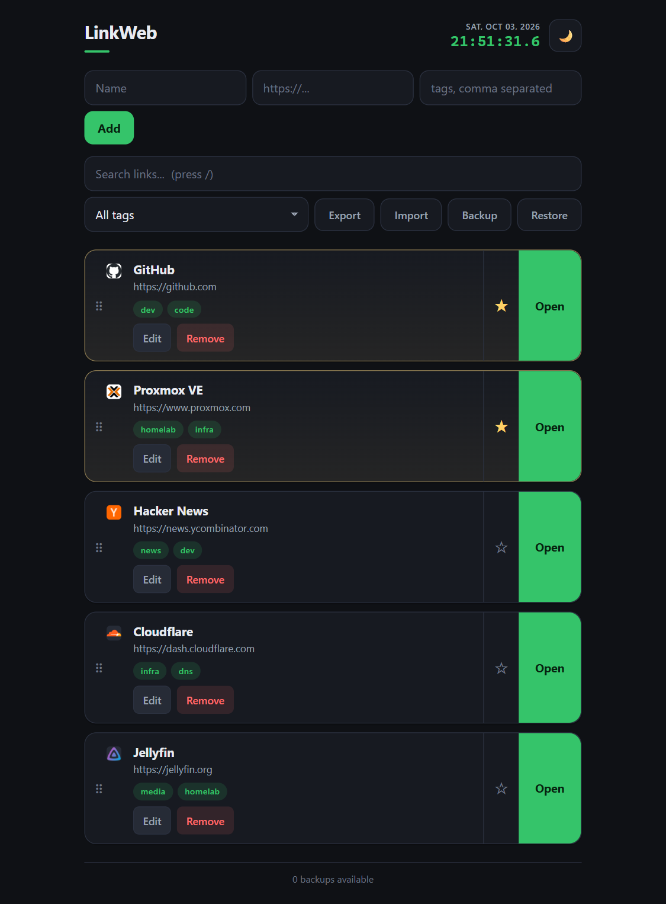

# LinkWeb

A self-hosted personal link dashboard. A tiny Flask app with a SQLite
database, one HTML page, and no build step — your bookmarks, running on your
own machine.



*Screenshots show sample data.*

## Features

- **Links with tags** — add a name, URL, and comma-separated tags; filter the
  list by tag with one click.
- **Favorites** — star a link to pin it to the top block.
- **Live search** — filter links by name, URL, or tag as you type (press `/`).
- **Drag to reorder** — pointer and touch friendly, with auto-scroll at the
  edges. Favorites keep their own block.
- **Light / dark theme** — toggle with the button or `t`; the choice is
  remembered in the browser.
- **Export / import JSON** — download every link as a portable JSON file, and
  merge one back in later.
- **Automatic backups** — `links.db` is snapshotted to `backups/` on every
  add, edit, delete, and import, keeping the newest 10. You can also trigger a
  backup by hand, and **restore** a snapshot or upload a `.db` file, all from
  the UI.
- **Favicons** — each link shows the site's icon.
- **Responsive** — works from 280 px phones up to wide desktops, in portrait
  and landscape; the layout reflows instead of scrolling sideways.
- **Basic auth** — optional HTTP Basic auth so the app can be exposed without
  giving everyone write access.

## Quick install

Requires Python 3.10+.

```bash
git clone <your-fork-url> LinkWeb
cd LinkWeb

python3 -m venv venv
source venv/bin/activate          # Windows: venv\Scripts\activate
pip install -r requirements.txt

# Optional: set credentials
cp .env.example .env
$EDITOR .env

python app.py
```

Open <http://localhost:6999>.

For production, run it under gunicorn:

```bash
gunicorn --workers 2 --bind 0.0.0.0:6999 app:app
```

## Usage

| Action | How |
| --- | --- |
| Add a link | Fill the form at the top and press **Add**. |
| Tag a link | Add comma-separated tags in the tags field, e.g. `homelab, infra`. |
| Search | Type in the search box, or press `/` to focus it. |
| Filter by tag | Pick a tag from the dropdown. |
| Favorite | Click the ☆ / ★ button. |
| Reorder | Drag a card by its handle (⠿). |
| Edit / remove | Use the **Edit** / **Remove** buttons on a card. |
| Export | Click **Export** to download `links.json`. |
| Import | Click **Import** and pick a JSON file exported earlier. |
| Back up now | Click **Backup**. |
| Restore a backup | Click **Restore**, pick a snapshot, then **Restore**. |
| Restore from a file | Click **Restore** → **Upload .db**. |
| Switch theme | Click the moon/sun button, or press `t`. |

### Keyboard shortcuts

| Key | Action |
| --- | --- |
| `/` | Focus search |
| `n` | Focus the "name" field of the add form |
| `t` | Toggle light / dark theme |
| `Esc` | Clear search, or leave the current field |

## Configuration

Configuration is merged from three sources, **highest priority first**:

1. Real environment variables
2. A `.env` file next to `app.py`
3. A `config.yaml` file next to `app.py`

Copy one of the examples to get started:

```bash
cp .env.example .env            # or
cp config.example.yaml config.yaml
```

| Setting | `.env` variable | `config.yaml` key | Default |
| --- | --- | --- | --- |
| Username | `LINKWEB_USER` | `auth.user` | *(empty)* |
| Password | `LINKWEB_PASSWORD` | `auth.password` | *(empty)* |
| Database path | `LINKWEB_DB` | `database.path` | `links.db` |
| Backup directory | `LINKWEB_BACKUP_DIR` | `backup.dir` | `backups` |
| Backups to keep | `LINKWEB_BACKUP_KEEP` | `backup.keep` | `10` |
| Bind host | `LINKWEB_HOST` | `server.host` | `0.0.0.0` |
| Bind port | `LINKWEB_PORT` | `server.port` | `6999` |

### Authentication

Set both a username and a password to enable HTTP Basic auth; every route is
then protected. Leave them empty and auth is disabled, which is convenient for
local development.

```bash
# .env
LINKWEB_USER=admin
LINKWEB_PASSWORD=change-me
```

```yaml
# config.yaml
auth:
  user: admin
  password: change-me
```

> Basic auth sends credentials in a reversible encoding, so always serve
> LinkWeb over HTTPS in front of the public internet (for example via a
> Cloudflare Tunnel or a reverse proxy with TLS).

## Running as a service

Example systemd unit, assuming the app lives in `/opt/linkweb`:

```ini
[Unit]
Description=LinkWeb - personal link dashboard
After=network-online.target
Wants=network-online.target

[Service]
Type=simple
WorkingDirectory=/opt/linkweb
Environment=LINKWEB_USER=admin
Environment=LINKWEB_PASSWORD=change-me
ExecStart=/opt/linkweb/venv/bin/gunicorn --workers 2 --bind 0.0.0.0:6999 app:app
Restart=always
RestartSec=3

[Install]
WantedBy=multi-user.target
```

```bash
sudo systemctl daemon-reload
sudo systemctl enable --now linkweb
```

Prefer keeping the password out of the unit file? Put it in `.env` or
`config.yaml` in `/opt/linkweb` instead and drop the `Environment=` lines.

## Data and backups

Everything lives in a single SQLite file (`links.db`). Schema changes are
applied additively on startup, so an existing database keeps working.

Backups are written to `backups/links-<timestamp>-<reason>.db` and pruned to
the newest `backup.keep` entries.

Restore from the UI: **Restore** → choose a snapshot → **Restore**, or
**Upload .db** to restore an arbitrary database file. Before anything is
replaced, the current `links.db` is snapshotted as `*-prerestore.db`, and the
file is validated as a SQLite database containing a `links` table, so a wrong
or corrupt file is rejected instead of wiping your data.

Restore manually by stopping the service and copying a snapshot over
`links.db`:

```bash
sudo systemctl stop linkweb
cp backups/links-20260101-120000-manual.db links.db
sudo systemctl start linkweb
```

## Project layout

```
app.py                 Flask routes and database access
config.py              Configuration loading (.env / config.yaml / env vars)
templates/index.html   The single page and its JavaScript
static/style.css       Design tokens and styles
requirements.txt       Runtime dependencies
```

## License

See the repository for license details.
